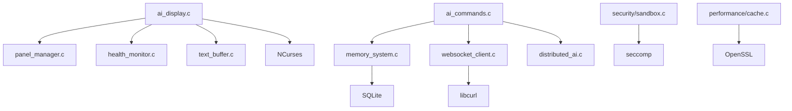

# ANBS Developer Guide

## Table of Contents
1. [Development Environment Setup](#development-environment-setup)
2. [Architecture Overview](#architecture-overview)
3. [Core Components](#core-components)
4. [Building ANBS](#building-anbs)
5. [Testing Framework](#testing-framework)
6. [API Integration](#api-integration)
7. [Plugin Development](#plugin-development)
8. [Contributing Guidelines](#contributing-guidelines)
9. [Debugging](#debugging)
10. [Performance Optimization](#performance-optimization)

## Development Environment Setup

### Prerequisites
```bash
# Ubuntu/Debian
sudo apt-get update
sudo apt-get install build-essential autotools-dev autoconf automake \
    libncurses5-dev libssl-dev libcurl4-openssl-dev libsqlite3-dev \
    libjson-c-dev pkg-config git

# Red Hat/CentOS/Fedora
sudo dnf install gcc gcc-c++ autotools autoconf automake \
    ncurses-devel openssl-devel libcurl-devel sqlite-devel \
    json-c-devel pkgconfig git

# macOS
brew install autoconf automake ncurses openssl curl sqlite json-c
```

### Development Dependencies
```bash
# Additional testing tools
sudo apt-get install valgrind gdb strace ltrace
pip install pytest pytest-cov black flake8

# Documentation tools
sudo apt-get install doxygen graphviz
npm install -g jsdoc
```

### IDE Configuration
#### Visual Studio Code
```json
{
    "c_cpp_properties": {
        "configurations": [{
            "name": "ANBS",
            "includePath": [
                "${workspaceFolder}/bash-5.2",
                "${workspaceFolder}/bash-5.2/ai_core",
                "/usr/include/ncurses",
                "/usr/include/json-c"
            ],
            "defines": ["ANBS_BUILD", "DEBUG"],
            "compilerPath": "/usr/bin/gcc"
        }]
    }
}
```

#### Vim/Neovim
```vim
" Add to .vimrc
set path+=/home/user/bash-ai-native/bash-5.2
set path+=/home/user/bash-ai-native/bash-5.2/ai_core
set makeprg=make\ -C\ /home/user/bash-ai-native/bash-5.2
```

## Architecture Overview

### High-Level Architecture
```
┌─────────────────────────────────────────────────┐
│                 ANBS Shell                      │
├─────────────────┬───────────────────────────────┤
│   GNU Bash 5.2  │     AI Core Modules           │
│   - Built-ins    │     - Display System         │
│   - Execution    │     - Memory System          │
│   - Variables    │     - AI Commands           │
│   - History      │     - WebSocket Client       │
└─────────────────┼───────────────────────────────┤
│                 Integration Layer               │
├─────────────────────────────────────────────────┤
│              System Libraries                   │
│   NCurses | libcurl | SQLite | OpenSSL         │
└─────────────────────────────────────────────────┘
```

### Module Dependencies


### Directory Structure
```
bash-ai-native/
├── bash-5.2/                  # GNU Bash source (modified)
│   ├── ai_core/               # ANBS AI integration modules
│   │   ├── ai_display.h       # Core display system header
│   │   ├── ai_display.c       # NCurses display implementation
│   │   ├── panel_manager.c    # Panel layout and management
│   │   ├── text_buffer.c      # Circular buffer for text
│   │   ├── health_monitor.c   # System health monitoring
│   │   ├── memory_system.c    # Vector search and storage
│   │   ├── websocket_client.c # WebSocket communication
│   │   ├── distributed_ai.c   # Multi-agent coordination
│   │   ├── utility.c          # Helper functions
│   │   ├── security/          # Security subsystem
│   │   │   ├── sandbox.c      # Execution sandboxing
│   │   │   └── permissions.c  # Role-based access control
│   │   └── performance/       # Performance optimization
│   │       ├── cache.c        # Response caching system
│   │       ├── metrics.c      # Performance monitoring
│   │       └── optimize.c     # Runtime optimization
│   ├── builtins/              # Bash built-in commands
│   │   └── ai_commands.c      # @vertex, @memory, @analyze
│   └── Makefile.in            # Modified build system
├── docs/                      # Documentation
├── tests/                     # Test suite
└── tools/                     # Development utilities
```

## Core Components

### Display System (ai_display.c)

#### Key Structures
```c
typedef struct anbs_display {
    WINDOW *main_screen;           // Main NCurses window
    panel_t panels[ANBS_PANEL_COUNT]; // Panel array
    int active_panel;              // Currently focused panel
    int term_width, term_height;   // Terminal dimensions
    bool split_mode_active;        // Split-screen enabled
    health_data_t health_data[10]; // Health monitoring data
    double terminal_ratio;         // Terminal panel width ratio
    double ai_chat_ratio;          // AI chat panel width ratio
} anbs_display_t;

typedef struct panel {
    WINDOW *window;          // NCurses window handle
    int x, y, width, height; // Panel dimensions
    panel_type_t type;       // TERMINAL, AI_CHAT, HEALTH
    bool visible;            // Panel visibility
    bool has_focus;          // Focus state
    text_buffer_t *buffer;   // Associated text buffer
    char title[64];          // Panel title
} panel_t;
```

#### Core Functions
```c
// Display initialization and cleanup
int anbs_display_init(anbs_display_t **display);
void anbs_display_cleanup(anbs_display_t *display);

// Panel management
int anbs_display_create_panel(anbs_display_t *display, panel_type_t type);
int anbs_display_switch_panel(anbs_display_t *display, int panel_id);
int anbs_display_resize_panels(anbs_display_t *display);

// Content rendering
int anbs_display_add_text(anbs_display_t *display, int panel_id,
                          const char *text, text_color_t color);
int anbs_display_refresh(anbs_display_t *display);
int anbs_display_clear_panel(anbs_display_t *display, int panel_id);
```

#### Event Handling
```c
// Input processing
int anbs_display_handle_input(anbs_display_t *display, int ch);
int anbs_display_handle_resize(anbs_display_t *display);
int anbs_display_handle_mouse(anbs_display_t *display, MEVENT *event);

// Keyboard shortcuts
typedef struct {
    int key_combination;
    anbs_action_t action;
    void (*handler)(anbs_display_t *display);
} keyboard_shortcut_t;
```

### Memory System (memory_system.c)

#### Vector Embeddings
```c
#define EMBEDDING_DIMENSION 1536

typedef struct memory_entry {
    char *command;                    // Original command/query
    char *response;                   // AI response
    char *context;                    // Additional context
    float embedding[EMBEDDING_DIMENSION]; // Vector representation
    time_t timestamp;                 // Creation time
    memory_type_t type;              // COMMAND, CONVERSATION, FILE
    double relevance_score;          // Search relevance
} memory_entry_t;

// Embedding generation
int generate_simple_embedding(const char *text, float *embedding);
double cosine_similarity(const float *vec1, const float *vec2, int dimension);

// Memory operations
int anbs_memory_store(const char *command, const char *response,
                      const char *context, memory_type_t type);
int anbs_memory_search(const char *query, memory_entry_t **results,
                       int max_results);
int anbs_memory_cleanup(int max_age_days);
```

#### Database Schema
```sql
CREATE TABLE memory_entries (
    id INTEGER PRIMARY KEY AUTOINCREMENT,
    command TEXT NOT NULL,
    response TEXT,
    context TEXT,
    embedding BLOB,           -- Serialized float array
    timestamp INTEGER,
    type INTEGER,
    relevance_score REAL
);

CREATE INDEX idx_timestamp ON memory_entries(timestamp);
CREATE INDEX idx_type ON memory_entries(type);
```

### AI Commands (ai_commands.c)

#### Command Registration
```c
// Built-in command structure
struct builtin anbs_builtins[] = {
    { "vertex", vertex_builtin, BUILTIN_ENABLED, vertex_doc, 0 },
    { "memory", memory_builtin, BUILTIN_ENABLED, memory_doc, 0 },
    { "analyze", analyze_builtin, BUILTIN_ENABLED, analyze_doc, 0 },
    { (char *)NULL, (sh_builtin_func_t *)NULL, 0, (char *)NULL, 0 }
};

// Command implementation
int vertex_builtin(WORD_LIST *list) {
    struct ai_options opts;
    char *response = NULL;
    int result;

    // Parse command line options
    if (parse_ai_options(list, &opts) != 0) {
        return EXECUTION_FAILURE;
    }

    // Send query to AI service
    result = send_ai_query(opts.query, opts.model, opts.timeout, &response);

    if (result == 0 && response) {
        printf("%s\n", response);
        anbs_memory_store(opts.query, response, NULL, MEMORY_TYPE_CONVERSATION);
        free(response);
        return EXECUTION_SUCCESS;
    }

    return EXECUTION_FAILURE;
}
```

#### Option Parsing
```c
typedef struct ai_options {
    char *query;
    char *model;
    int timeout;
    bool stream;
    bool health_check;
    output_format_t format;
} ai_options_t;

// Command line option parsing
static struct option long_options[] = {
    {"model", required_argument, 0, 'm'},
    {"timeout", required_argument, 0, 't'},
    {"stream", no_argument, 0, 's'},
    {"health", no_argument, 0, 'h'},
    {"format", required_argument, 0, 'f'},
    {0, 0, 0, 0}
};
```

### WebSocket Client (websocket_client.c)

#### Connection Management
```c
typedef struct websocket_client {
    int socket_fd;
    SSL *ssl;
    SSL_CTX *ssl_ctx;
    char *host;
    int port;
    bool use_ssl;
    ws_state_t state;
    pthread_mutex_t send_mutex;
    uint8_t *frame_buffer;
    size_t buffer_size;
} websocket_client_t;

// Connection lifecycle
int anbs_websocket_connect(websocket_client_t **client, const char *url);
int anbs_websocket_send_message(websocket_client_t *client, const char *message);
int anbs_websocket_receive_message(websocket_client_t *client, char **message);
void anbs_websocket_disconnect(websocket_client_t *client);
```

#### Frame Processing
```c
// WebSocket frame structure (RFC 6455)
typedef struct ws_frame {
    uint8_t fin:1;
    uint8_t rsv1:1;
    uint8_t rsv2:1;
    uint8_t rsv3:1;
    uint8_t opcode:4;
    uint8_t mask:1;
    uint8_t payload_len:7;
    uint32_t masking_key;
    uint8_t *payload;
} ws_frame_t;

// Frame operations
int parse_websocket_frame(const uint8_t *data, size_t len, ws_frame_t *frame);
int create_websocket_frame(const char *payload, uint8_t opcode,
                          uint8_t **frame_data, size_t *frame_len);
```

## Building ANBS

### Build System
The ANBS build system extends GNU Bash's autotools configuration:

```bash
# Configure build
cd bash-5.2
./configure --prefix=/usr/local/anbs \
           --enable-ai-integration \
           --with-ncurses \
           --with-curl \
           --with-sqlite3 \
           --with-json-c

# Compile
make clean
make -j$(nproc)

# Install
sudo make install
```

### Makefile Modifications
Key additions to `Makefile.in`:

```makefile
# AI Core objects
AI_CORE_OBJS = ai_core/ai_display.o ai_core/panel_manager.o \
               ai_core/text_buffer.o ai_core/health_monitor.o \
               ai_core/memory_system.o ai_core/websocket_client.o \
               ai_core/distributed_ai.o ai_core/utility.o \
               ai_core/security/sandbox.o ai_core/security/permissions.o \
               ai_core/performance/cache.o ai_core/performance/metrics.o \
               ai_core/performance/optimize.o

# AI Commands
AI_BUILTIN_OBJS = builtins/ai_commands.o

# Add to main objects
OBJECTS = $(BUILTIN_OBJS) $(AI_BUILTIN_OBJS) $(AI_CORE_OBJS) ...

# AI Core compilation rules
ai_core/%.o: ai_core/%.c
	$(CC) $(CFLAGS) $(AI_CFLAGS) -c $< -o $@

# Additional libraries
LIBS += -lncurses -lcurl -lsqlite3 -ljson-c -lssl -lcrypto -lpthread
```

### Configuration Options
```bash
# Development build with debug symbols
./configure --enable-debug --enable-ai-integration

# Production build with optimizations
./configure --enable-optimizations --disable-debug

# Minimal build
./configure --disable-ai-features --enable-basic-only

# Custom library paths
./configure --with-ncurses-dir=/opt/ncurses \
           --with-curl-dir=/opt/curl
```

### Cross-Compilation
```bash
# ARM64 cross-compilation
./configure --host=aarch64-linux-gnu \
           --with-sysroot=/usr/aarch64-linux-gnu

# Static linking for deployment
./configure --enable-static-linking \
           --disable-shared
```

## Testing Framework

### Test Structure
```
tests/
├── unit/                    # Unit tests for individual components
│   ├── test_display.c      # Display system tests
│   ├── test_memory.c       # Memory system tests
│   ├── test_websocket.c    # WebSocket tests
│   └── test_commands.c     # AI command tests
├── integration/            # Integration tests
│   ├── test_full_system.c  # End-to-end tests
│   └── test_performance.c  # Performance benchmarks
├── functional/             # Functional tests
│   ├── test_scenarios.sh   # User scenario tests
│   └── test_regression.sh  # Regression tests
└── fixtures/               # Test data and mocks
    ├── mock_responses.json
    └── sample_files/
```

### Unit Testing Framework
```c
// Test framework macros
#define ASSERT_EQ(expected, actual) \
    do { \
        if ((expected) != (actual)) { \
            fprintf(stderr, "FAIL: %s:%d Expected %d, got %d\n", \
                   __FILE__, __LINE__, expected, actual); \
            return -1; \
        } \
    } while(0)

#define ASSERT_STR_EQ(expected, actual) \
    do { \
        if (strcmp(expected, actual) != 0) { \
            fprintf(stderr, "FAIL: %s:%d Expected '%s', got '%s'\n", \
                   __FILE__, __LINE__, expected, actual); \
            return -1; \
        } \
    } while(0)

// Test runner
typedef struct test_case {
    const char *name;
    int (*test_func)(void);
} test_case_t;

int run_test_suite(test_case_t *tests, int count);
```

### Mock Framework
```c
// Mock AI service for testing
typedef struct mock_ai_service {
    char **responses;
    int response_count;
    int current_response;
    int simulate_delay_ms;
    bool simulate_failure;
} mock_ai_service_t;

// Mock functions
int mock_send_ai_query(const char *query, const char *model,
                      int timeout, char **response);
void mock_set_responses(mock_ai_service_t *mock, char **responses, int count);
void mock_simulate_failure(mock_ai_service_t *mock, bool enable);
```

### Test Execution
```bash
# Run all tests
make test

# Run specific test suite
make test-unit
make test-integration
make test-functional

# Run with coverage
make test-coverage

# Run with valgrind
make test-valgrind

# Performance benchmarks
make benchmark
```

### Continuous Integration
```yaml
# .github/workflows/ci.yml
name: ANBS CI
on: [push, pull_request]
jobs:
  test:
    runs-on: ubuntu-latest
    steps:
    - uses: actions/checkout@v2
    - name: Install dependencies
      run: |
        sudo apt-get update
        sudo apt-get install -y build-essential libncurses5-dev \
          libcurl4-openssl-dev libsqlite3-dev libjson-c-dev
    - name: Configure
      run: cd bash-5.2 && ./configure --enable-ai-integration
    - name: Build
      run: cd bash-5.2 && make -j$(nproc)
    - name: Test
      run: cd bash-5.2 && make test
    - name: Coverage
      run: cd bash-5.2 && make test-coverage
```

## API Integration

### AI Service Integration
```c
// AI service configuration
typedef struct ai_service_config {
    char *api_endpoint;
    char *api_key;
    char *default_model;
    int timeout_seconds;
    int max_retries;
    bool use_streaming;
} ai_service_config_t;

// HTTP request handling
typedef struct http_response {
    char *body;
    size_t body_size;
    long status_code;
    char *content_type;
} http_response_t;

int make_http_request(const char *url, const char *headers[],
                     const char *body, http_response_t *response);
```

### JSON Processing
```c
#include <json-c/json.h>

// Parse AI response
int parse_ai_response(const char *json_str, char **response_text) {
    json_object *root = json_tokener_parse(json_str);
    json_object *choices, *choice, *message, *content;

    if (!json_object_object_get_ex(root, "choices", &choices))
        return -1;

    choice = json_object_array_get_idx(choices, 0);
    if (!json_object_object_get_ex(choice, "message", &message))
        return -1;

    if (!json_object_object_get_ex(message, "content", &content))
        return -1;

    *response_text = strdup(json_object_get_string(content));
    json_object_put(root);
    return 0;
}

// Create request payload
char *create_ai_request(const char *prompt, const char *model) {
    json_object *root = json_object_new_object();
    json_object *model_obj = json_object_new_string(model);
    json_object *messages = json_object_new_array();
    json_object *message = json_object_new_object();
    json_object *role = json_object_new_string("user");
    json_object *content = json_object_new_string(prompt);

    json_object_object_add(message, "role", role);
    json_object_object_add(message, "content", content);
    json_object_array_add(messages, message);

    json_object_object_add(root, "model", model_obj);
    json_object_object_add(root, "messages", messages);

    const char *json_str = json_object_to_json_string(root);
    char *result = strdup(json_str);
    json_object_put(root);
    return result;
}
```

### Error Handling
```c
typedef enum {
    AI_SUCCESS = 0,
    AI_ERROR_NETWORK = -1,
    AI_ERROR_AUTH = -2,
    AI_ERROR_QUOTA = -3,
    AI_ERROR_TIMEOUT = -4,
    AI_ERROR_PARSE = -5,
    AI_ERROR_MODEL = -6
} ai_error_t;

const char *ai_error_string(ai_error_t error) {
    switch (error) {
        case AI_SUCCESS: return "Success";
        case AI_ERROR_NETWORK: return "Network error";
        case AI_ERROR_AUTH: return "Authentication failed";
        case AI_ERROR_QUOTA: return "API quota exceeded";
        case AI_ERROR_TIMEOUT: return "Request timeout";
        case AI_ERROR_PARSE: return "Response parse error";
        case AI_ERROR_MODEL: return "Model not available";
        default: return "Unknown error";
    }
}
```

## Plugin Development

### Plugin Architecture
```c
// Plugin interface
typedef struct anbs_plugin {
    char name[64];
    char version[16];
    char description[256];

    // Plugin lifecycle
    int (*init)(void);
    int (*cleanup)(void);

    // Command handlers
    int (*handle_command)(const char *cmd, char **response);

    // Event handlers
    int (*on_ai_response)(const char *query, const char *response);
    int (*on_memory_store)(const char *key, const char *value);

    // Configuration
    int (*configure)(const char *config_json);
} anbs_plugin_t;

// Plugin manager
int anbs_plugin_load(const char *plugin_path);
int anbs_plugin_unload(const char *plugin_name);
int anbs_plugin_list(char ***plugin_names, int *count);
```

### Example Plugin
```c
// sample_plugin.c
#include "anbs_plugin.h"

static int sample_init(void) {
    printf("Sample plugin initialized\n");
    return 0;
}

static int sample_cleanup(void) {
    printf("Sample plugin cleaned up\n");
    return 0;
}

static int sample_handle_command(const char *cmd, char **response) {
    if (strstr(cmd, "@sample") == cmd) {
        *response = strdup("Hello from sample plugin!");
        return 0;
    }
    return -1; // Not handled
}

// Plugin export
anbs_plugin_t sample_plugin = {
    .name = "sample",
    .version = "1.0.0",
    .description = "Sample ANBS plugin",
    .init = sample_init,
    .cleanup = sample_cleanup,
    .handle_command = sample_handle_command
};

// Plugin entry point
anbs_plugin_t *anbs_plugin_export(void) {
    return &sample_plugin;
}
```

### Plugin Building
```makefile
# Plugin Makefile
CC = gcc
CFLAGS = -Wall -Wextra -fPIC -shared
INCLUDES = -I../bash-5.2/ai_core

sample_plugin.so: sample_plugin.c
	$(CC) $(CFLAGS) $(INCLUDES) -o $@ $<

install: sample_plugin.so
	cp sample_plugin.so ~/.config/anbs/plugins/

clean:
	rm -f *.so
```

## Contributing Guidelines

### Code Style
```c
// Function naming: anbs_module_action
int anbs_display_create_panel(anbs_display_t *display, panel_type_t type);

// Variable naming: snake_case
int panel_count = 0;
char *response_buffer = NULL;

// Constants: UPPER_CASE with module prefix
#define ANBS_MAX_PANELS 10
#define ANBS_DEFAULT_TIMEOUT 30

// Error handling: Always check return values
int result = anbs_memory_store(cmd, response, NULL, MEMORY_TYPE_COMMAND);
if (result != 0) {
    ANBS_DEBUG_LOG("Failed to store memory entry: %d", result);
    return EXECUTION_FAILURE;
}
```

### Documentation Standards
```c
/**
 * @brief Create a new display panel
 * @param display Pointer to display structure
 * @param type Type of panel to create (TERMINAL, AI_CHAT, HEALTH)
 * @return Panel ID on success, -1 on error
 *
 * Creates a new panel of the specified type and adds it to the display.
 * The panel is initially hidden and must be made visible with
 * anbs_display_show_panel().
 *
 * @see anbs_display_show_panel()
 * @see anbs_display_destroy_panel()
 */
int anbs_display_create_panel(anbs_display_t *display, panel_type_t type);
```

### Commit Message Format
```
type(scope): brief description

Detailed explanation of the change, including motivation and
implementation details.

Fixes #123
Relates to #456
```

Types: `feat`, `fix`, `docs`, `style`, `refactor`, `test`, `chore`
Scopes: `display`, `memory`, `commands`, `websocket`, `security`, `performance`

### Pull Request Process
1. Fork the repository
2. Create a feature branch: `git checkout -b feature/amazing-feature`
3. Make changes following code style guidelines
4. Add tests for new functionality
5. Update documentation
6. Run test suite: `make test`
7. Create pull request with detailed description

### Issue Reporting
```markdown
## Bug Report
**ANBS Version**: 1.0.0
**OS**: Ubuntu 22.04
**Terminal**: GNOME Terminal 3.44

**Description**: Brief description of the issue

**Steps to Reproduce**:
1. Step one
2. Step two
3. Step three

**Expected Behavior**: What should happen
**Actual Behavior**: What actually happens

**Debug Log**:
```
[Paste debug log here]
```

**Additional Context**: Any other relevant information
```

## Debugging

### Debug Logging
```c
// Debug levels
typedef enum {
    ANBS_LOG_ERROR = 0,
    ANBS_LOG_WARN = 1,
    ANBS_LOG_INFO = 2,
    ANBS_LOG_DEBUG = 3,
    ANBS_LOG_TRACE = 4
} anbs_log_level_t;

// Debug macros
#ifdef ANBS_DEBUG
#define ANBS_DEBUG_LOG(level, fmt, ...) \
    anbs_log(level, __FILE__, __LINE__, fmt, ##__VA_ARGS__)
#else
#define ANBS_DEBUG_LOG(level, fmt, ...) do {} while(0)
#endif

// Logging function
void anbs_log(anbs_log_level_t level, const char *file, int line,
              const char *fmt, ...);
```

### Memory Debugging
```bash
# Valgrind memory checking
valgrind --tool=memcheck --leak-check=full \
         --show-leak-kinds=all --track-origins=yes \
         ./anbs

# AddressSanitizer (compile with -fsanitize=address)
export ASAN_OPTIONS="abort_on_error=1:halt_on_error=1"
./anbs

# Static analysis with cppcheck
cppcheck --enable=all --inconclusive \
         --suppress=missingIncludeSystem \
         bash-5.2/ai_core/
```

### Performance Debugging
```bash
# CPU profiling with perf
perf record -g ./anbs
perf report

# System call tracing
strace -f -e trace=network,file ./anbs

# Function call tracing
ltrace -f ./anbs
```

### GDB Debugging
```bash
# Compile with debug symbols
make CFLAGS="-g -O0 -DANBS_DEBUG"

# GDB session
gdb ./anbs
(gdb) set environment ANBS_DEBUG=1
(gdb) break anbs_display_init
(gdb) run
(gdb) bt           # Backtrace
(gdb) info locals  # Local variables
(gdb) print variable_name
```

## Performance Optimization

### Profiling
```c
// Performance measurement macros
#define ANBS_PERF_START(name) \
    struct timeval _perf_start_##name; \
    gettimeofday(&_perf_start_##name, NULL)

#define ANBS_PERF_END(name) \
    do { \
        struct timeval _perf_end_##name; \
        gettimeofday(&_perf_end_##name, NULL); \
        double _elapsed = (_perf_end_##name.tv_sec - _perf_start_##name.tv_sec) * 1000.0 + \
                         (_perf_end_##name.tv_usec - _perf_start_##name.tv_usec) / 1000.0; \
        ANBS_DEBUG_LOG(ANBS_LOG_DEBUG, "PERF: %s took %.2fms", #name, _elapsed); \
    } while(0)

// Usage
ANBS_PERF_START(ai_query);
result = send_ai_query(query, model, timeout, &response);
ANBS_PERF_END(ai_query);
```

### Memory Optimization
```c
// Object pooling for frequent allocations
typedef struct object_pool {
    void **objects;
    int count;
    int capacity;
    size_t object_size;
    pthread_mutex_t mutex;
} object_pool_t;

void *pool_alloc(object_pool_t *pool);
void pool_free(object_pool_t *pool, void *obj);

// Memory-mapped files for large data
int anbs_mmap_file(const char *filename, void **data, size_t *size);
int anbs_munmap_file(void *data, size_t size);
```

### Cache Optimization
```c
// Cache-friendly data structures
typedef struct cache_line_aligned {
    char data[64];  // Align to cache line boundary
} __attribute__((aligned(64))) cache_line_t;

// Branch prediction hints
#define likely(x)   __builtin_expect(!!(x), 1)
#define unlikely(x) __builtin_expect(!!(x), 0)

if (likely(cache_hit)) {
    // Fast path
} else {
    // Slow path
}
```

### Compilation Optimizations
```makefile
# Production optimization flags
OPTFLAGS = -O3 -march=native -mtune=native -flto
CFLAGS += $(OPTFLAGS)

# Profile-guided optimization
make profile-generate
./anbs < typical_usage_script.sh
make profile-use
```

This developer guide provides the foundation for contributing to ANBS development, from initial setup through advanced optimization techniques.